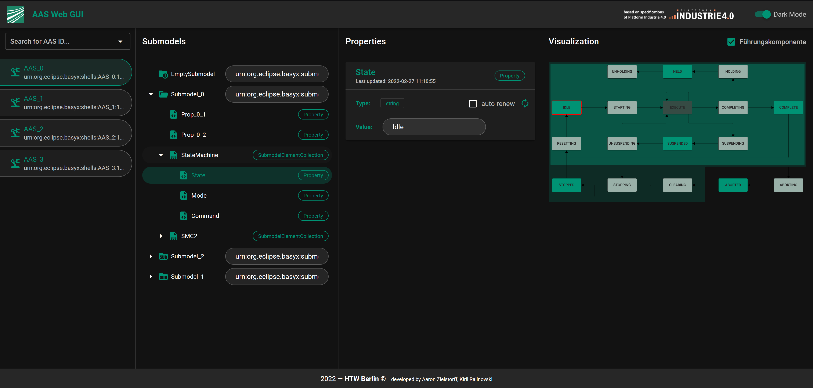

# Fraunhofer AAS GUI
Vue.js Webapplication to select and visualize Asset Administration Shells, Submodels and Properties.

## Project Structure

```mermaid
    flowchart LR
    subgraph Project Example
        root --> Frontend
        root --> Backend
        root --> Docs
        root --> README.md
        root --> LICENSE
        root --> .gitignore
        subgraph Frontend
            fraunhofer-web-gui
        end
        subgraph Backend
            AAS-Generator
            Registry
        end
        subgraph Docs
            Figs
        end
    end
```

## Getting Started

### MacOS:

1. Install Node and NPM ([Node installation Tutorial for Mac](https://treehouse.github.io/installation-guides/mac/node-mac.html))
2. Install Vue CLI `npm install -g @vue/cli`
3. Clone Repository: `git clone https://github.com/eclipse-basyx/basyx-applications.git`
4. `cd basyx-applications/aas-gui`
5. `. bootstrap.sh`
6. On initial installation answer first question with **y** (Yes) otherwise **n** (No)
7. Answer second question with **n** (No)

### Linux:

1. Install Node and NPM ([Node installation Tutorial for Linux](https://nodejs.org/en/download/package-manager/))
2. Install Vue CLI `npm install -g @vue/cli`
3. Clone Repository: `git clone https://github.com/eclipse-basyx/basyx-applications.git`
4. `cd basyx-applications/aas-gui`
5. `. bootstrap.sh`
6. On initial installation answer first question with **y** (Yes) otherwise **n** (No)
7. Answer second question with **n** (No)

### Windows:

1. Install WSL 2 ([WSL installation Tutorial](https://docs.microsoft.com/en-us/windows/wsl/install))
2. Open IDE (e.g. VSCode: [WSL in VSCode](https://code.visualstudio.com/docs/remote/wsl))
3. Install Node and NPM ([Node installation Tutorial for Linux](https://nodejs.org/en/download/package-manager/))
4. Install Vue CLI `npm install -g @vue/cli`
5. Clone Repository: `git clone https://github.com/eclipse-basyx/basyx-applications.git`
6. `cd basyx-applications/aas-gui`
7. `. bootstrap.sh`
8. On initial installation answer first question with **y** (Yes) otherwise **n** (No)
9. Answer second question with **n** (No)

## Demo :rocket:

Demo available here: [**aas-gui.plc-visu.com**](http://aas-gui.plc-visu.com/)
The following address can be used as demo registry server: [**http://52.170.212.185:4999**](http://52.170.212.185:4999)

## Milestones

### Current Milestone: 

- **Release 1.0.0** :white_check_mark:

### Finished Milestones:

- **Beta Release** :white_check_mark:

- **Alpha Release** :white_check_mark:

## Frontend

Start Dev Environment (e.g. VSCode):
1. Open Terminal/shell on the root directory of the project (`cd basyx-applications/aas-gui`)
2. `. bootstrap.sh`
3. On initial installation answer first question with **y** (Yes) otherwise **n** (No)
4. Answer second question with **n** (No)

Create deployable build:
1. Open Terminal/shell on the root directory of the project (`basyx-applications/aas-gui`)
2. `. bootstrap.sh`
3. On initial installation answer first question with **y** (Yes) otherwise **n** (No)
4. Answer second question with **y** (Yes)
5. Source Files are created here: `basyx-applications/aas-gui/Frontend/fraunhofer-web-gui/dist`

### Dependencies

- Node (+ npm)
- vue cli
- Vuetify

## Backend
The backend consists of two components. The Asset Administration Shell **Generator** and the **Registry**-Server. 

To run the backend, the following two steps are mandatory:
    
> Start the Registry-Server (`basyx-applications/aas-gui/Backend/Registry/`)

> Start the Generator (`basyx-applications/aas-gui/Backend/AAS-Generator/`)

The registry server is available under the port **4999**. The generator deploys 4 Asset Administration Shells, which are listening to the ports **5081-5084**. Each service comes with its own UI. The registry server can be found under this URL: http://localhost:4999. Each Web-UI has its own Swagger, which describes the API interface.
